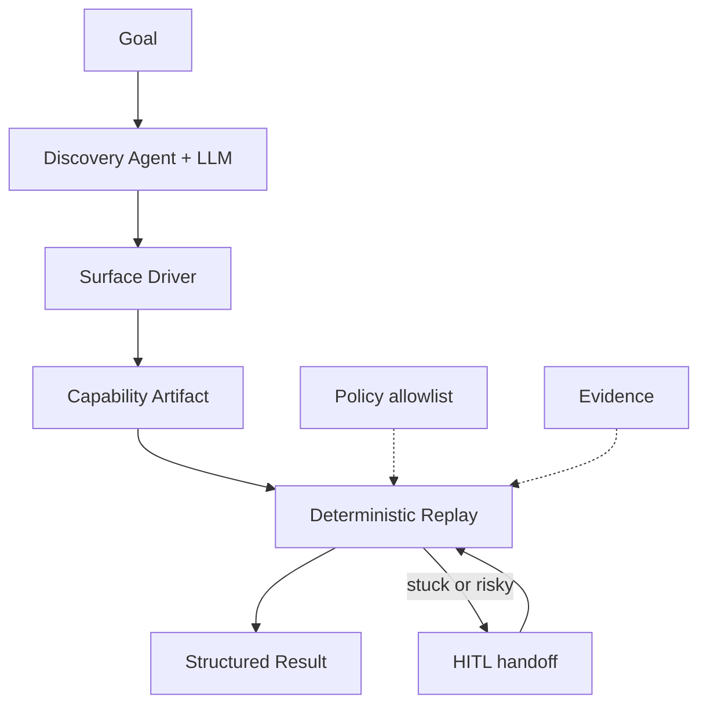
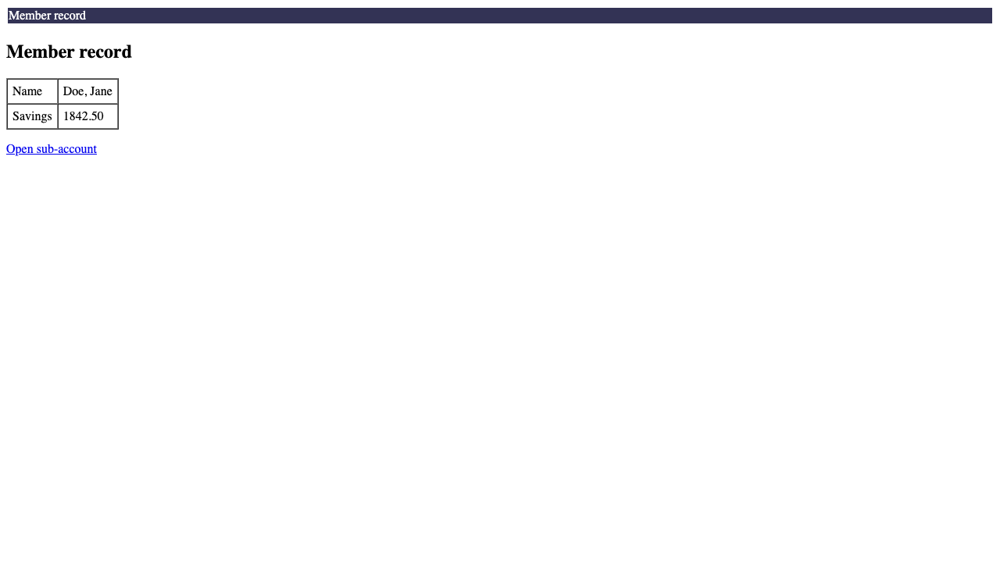
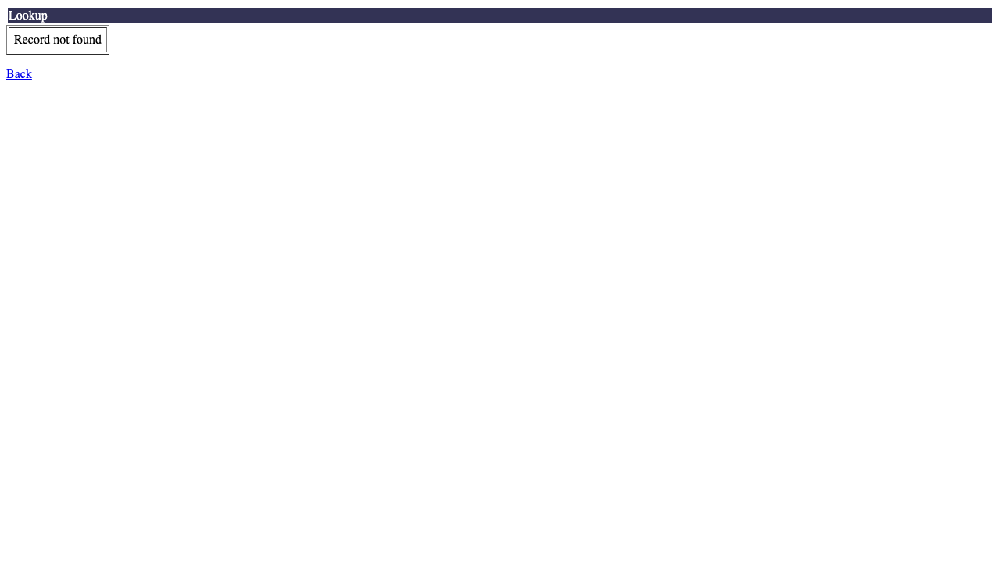
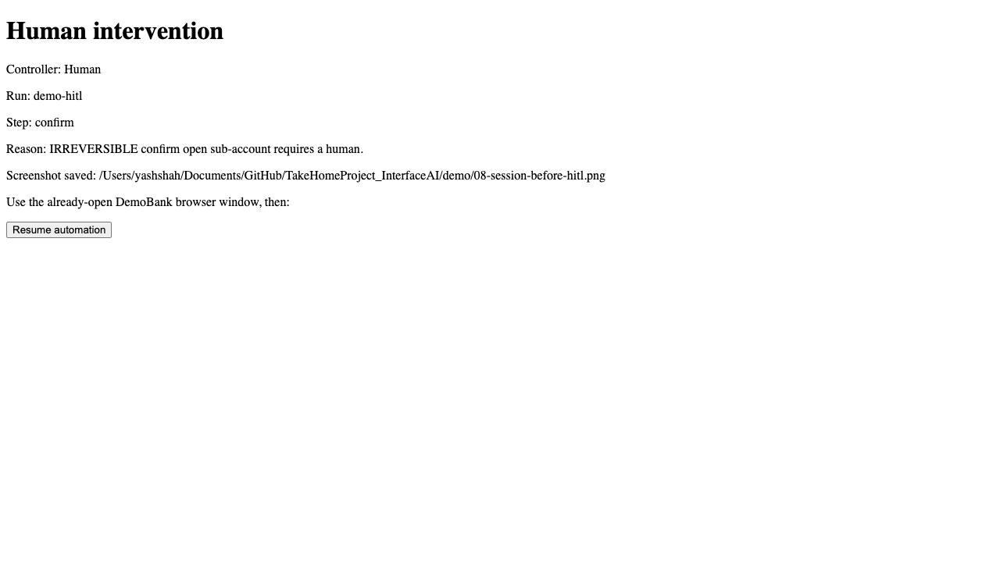

# Computer Use Capability Engine

LLM-driven computer-use discovery that produces typed, reusable capability artifacts which can subsequently execute through deterministic replay, with policy guardrails and human-in-the-loop handoff.

LLM discovers. Artifact records. Replay executes deterministically. Human takes control when automation cannot safely continue.

This repository is an [interface.ai](https://interface.ai) take-home vertical slice: discover a member-balance lookup on a local DemoBank UI, save a typed JSON capability, then replay it without the model.

## What This Demonstrates

- **LLM used during discovery, not production replay.** The model explores the UI once. Later invocations follow the saved artifact.
- **Typed, versioned capability artifacts.** Steps, locators, inputs, and outputs are data — not a model transcript.
- **Deterministic replay.** No LLM in the replay loop: parameter substitution, allowlist checks, locator fallbacks (logged as `degradations` when a lower tier wins), checkpoints.
- **Business outcomes vs system failures.** Declared `knownOutcomes` on the artifact (e.g. `MEMBER_NOT_FOUND`) are `BusinessOutcome`. A locator miss is `HardFailure`.
- **Recoverable interruptions.** A known interstitial (DemoBank member **88888**) is dismissed and replayed; the result is `Recoverable` with outputs.
- **Approval gating.** Live discovery writes `draft`. RISKY/IRREVERSIBLE replay requires `approved` unless `--allow-draft`.
- **Explicit policy/safety.** Host/port/path/action allowlists; risk classes; RISKY/IRREVERSIBLE steps do not run unattended.
- **Evidence.** Screenshots, structured `result.json`, and run folders under `/evidence`. `stability` replays N times and writes a pass-rate report.
- **Human-in-the-loop.** Automation pauses on the same headed browser; an operator page on `:5200` shows the screenshot. Resume is refused (HTTP 409) until the human acts on the live session. Human actions are recorded on the result.
- **Surface abstraction.** `ISurfaceDriver` is the perceive/act seam. Playwright is the current driver; the artifact schema is not Playwright-specific.

## Architecture



`ComputerUse.Cli` is the composition root: it hosts discovery, replay, policy, artifacts, evidence, and HITL in one process. DemoBank is a separate app (`:5100`). Operator UI is loopback Kestrel (`:5200`). Discovery talks to `ILanguageModel`; replay talks to `IReplayEngine` and `ISurfaceDriver` (Domain). Playwright is the current driver adapter. Protocol strings (approval, risk, actions, member IDs, ports) live in Domain `Constants` — JSON on disk uses the same values.

## Repository Structure

| Path | Role |
| --- | --- |
| `src/` | Production and DemoBank implementation |
| `tests/` | Automated unit and scripted browser verification |
| `evidence/` | Sanitized screenshots, results, and run folders from real executions |
| `artifacts/` | Capability JSON consumed by replay (runtime input, not process docs) |
| `ai-dlc/` | Supplementary engineering lifecycle artifacts |
| `config/` | Allowlist / policy configuration |
| `REPORT.md` | Required design write-up |

`.cursor/`, `.aidlc-rule-details/`, `aidlc-rules/`, and `aidlc-docs/` are AI-DLC **tooling** paths. They are not part of the runtime architecture. See [ai-dlc/README.md](ai-dlc/README.md).

## Prerequisites

- **.NET 8** SDK
- **Chromium** via Playwright (after first build):

```bash
dotnet restore
dotnet build
pwsh tests/ComputerUse.Tests/bin/Debug/net8.0/playwright.ps1 install chromium
```

- **Amazon Bedrock** only for live discovery (optional). Credentials stay in your environment — never in the repo.

```bash
export LLM_PROVIDER=bedrock
export BEDROCK_MODEL_ID=amazon.nova-lite-v1:0
export AWS_REGION=us-east-1
```

Without live AWS: use `--scripted` discovery and `dotnet test`. Replay still needs DemoBank + Chromium.

## Tests

```bash
dotnet test
```

Unit tests use an in-memory `FakeSurfaceDriver` (no browser). Integration tests (`[Trait("Category", "Integration")]`) start DemoBank and Playwright Chromium. All tests follow Arrange–Act–Assert with `Method_Scenario_Expected` names.

## Quick Start / End-to-End Demo

Known member: **12345** (savings **1842.50**). Transient: **88888** (first lookup shows a dismissible interruption, then **500.00**). Unknown: **00000**. Default browser is **headed**; add `--headless` if needed.

### 1. Restore / build

```bash
dotnet restore
dotnet build
```

### 2. Start DemoBank

```bash
dotnet run --project src/DemoBank
# http://127.0.0.1:5100
```

Leave this running.

### 3. Run LLM discovery (optional)

Scripted (no LLM, writes `artifacts/lookup-savings-balance.json`):

```bash
dotnet run --project src/ComputerUse.Cli -- discover --scripted
```

Live Bedrock:

```bash
dotnet run --project src/ComputerUse.Cli -- discover \
  --goal "look up member 12345 and read their current savings balance" \
  --url http://127.0.0.1:5100
```

A committed artifact already exists, so you can skip this and go straight to replay.

### 4. Replay the saved capability (no LLM)

```bash
dotnet run --project src/ComputerUse.Cli -- replay \
  --artifact artifacts/lookup-savings-balance.json \
  --member-id 12345 \
  --url http://127.0.0.1:5100
```

Expected: `"kind": "Success"`, `"balance": "1842.50"`.



### 5. Business outcome (member not found)

```bash
dotnet run --project src/ComputerUse.Cli -- replay --member-id 00000 --url http://127.0.0.1:5100
```

Expected: `"kind": "BusinessOutcome"`, `"message": "MEMBER_NOT_FOUND"`, not a crash.



Recoverable interstitial (member **88888**):

```bash
dotnet run --project src/ComputerUse.Cli -- replay --member-id 88888 --url http://127.0.0.1:5100 --headless
```

Expected: `"kind": "Recoverable"`, `"balance": "500.00"`, plus `recoveryEvents`.

Simulated locator miss (hard failure):

```bash
dotnet run --project src/ComputerUse.Cli -- replay --simulate-failure --url http://127.0.0.1:5100
```

### 6. Human handoff

Sub-account confirm is **IRREVERSIBLE**. Automation pauses; the same headed browser stays on DemoBank.

```bash
dotnet run --project src/ComputerUse.Cli -- hitl --url http://127.0.0.1:5100
```

1. Headed Chromium stays on DemoBank (confirm page).
2. Open http://127.0.0.1:5200 (operator page — includes a screenshot).
3. Click or type **at least once** in the bank window (empty resume is refused).
4. Click **Resume automation**.



To recapture walkthrough screenshots: `dotnet run --project src/ComputerUse.Cli -- capture-demo --url http://127.0.0.1:5100` (writes under `evidence/demo-captures/`).

### 7. Approve and stability

Live discovery writes `approvalState: draft`. Promote a file in place:

```bash
dotnet run --project src/ComputerUse.Cli -- approve --artifact artifacts/lookup-savings-balance.json
```

RISKY/IRREVERSIBLE replay (the `hitl` flow) requires `approved` unless you pass `--allow-draft`.

Replay the lookup N times and write `evidence/stability-*/report.json` (headless by default; `--headed` to watch). A committed sample is at [`evidence/stability/report.json`](evidence/stability/report.json).

```bash
dotnet run --project src/ComputerUse.Cli -- stability --runs 5 --member-id 12345 --url http://127.0.0.1:5100
```

## Evidence

[`/evidence`](evidence/README.md) contains sanitized artifacts from representative runs (discovery UI shots, successful replay, not-found / hard-failure, HITL). New CLI runs also write timestamped folders under `evidence/`.

## AI-Assisted Development

Supplementary lifecycle artifacts (requirements, locked decisions) live in [`/ai-dlc`](ai-dlc/README.md). AI assistance was an engineering accelerator; design choices and submitted code remain the author’s responsibility.

## Design Write-Up

See [REPORT.md](REPORT.md).

## Known Limitations / Cuts

No capability catalog, no second tenant, no desktop driver, no co-browse, no production DR. [REPORT.md](REPORT.md) §7 is authoritative.
